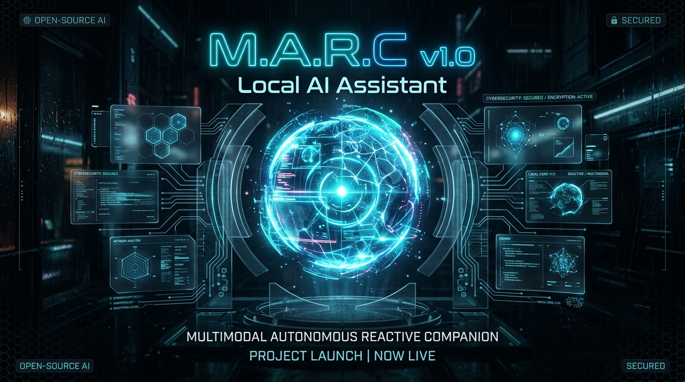
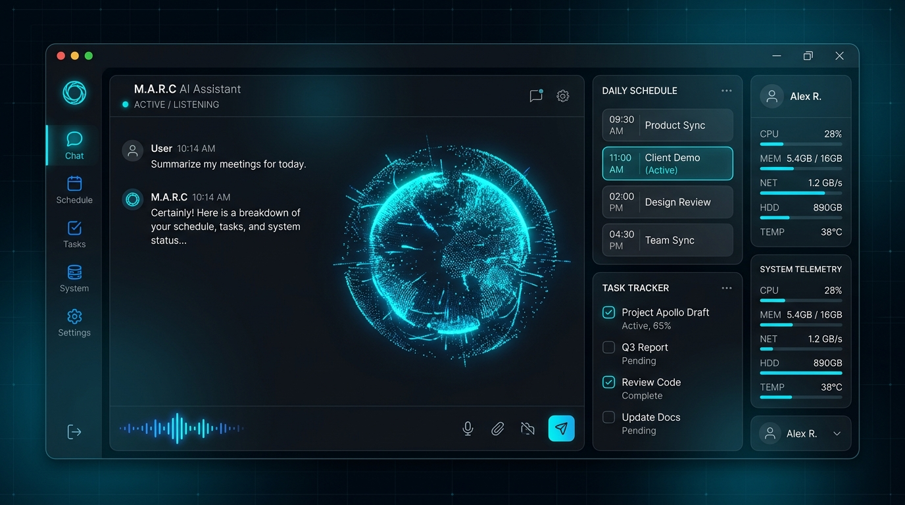
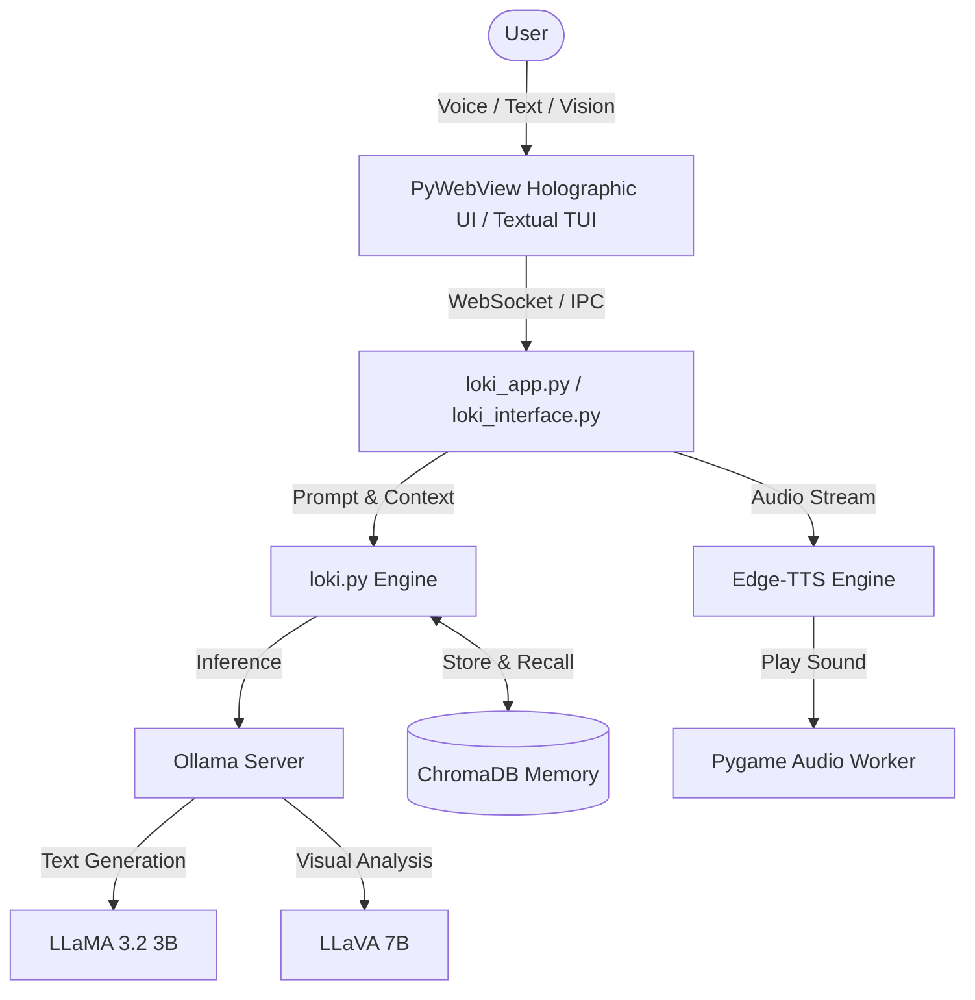

<p align="center">
  
</p>

<h1 align="center">M.A.R.C — Multimodal Autonomous Reactive Companion</h1>

<p align="center">
  <b>A 100% Local, Private, Voice & Vision-Enabled AI Assistant & Life Executive System</b>
</p>

<p align="center">
  <a href="#"></a>
  <a href="#"></a>
  <a href="#"></a>
  <a href="#"></a>
  <a href="#"></a>
</p>

---

## 🌟 Overview

**M.A.R.C** (*Multimodal Autonomous Reactive Companion*), powered by the **L.O.K.I** core engine, is an open-source, fully local AI assistant designed to give you a personal Jarvis-like experience without relying on paid API keys or cloud services. 

Built from the ground up for privacy, speed, and real-time interaction, MARC runs entirely on your local machine using **Ollama**, featuring real-time natural voice streaming, computer vision, persistent vector memory (RAG), and a full life-executive suite (schedule, task checklist, learning goals, daily briefings).

---

## 📸 Interface Preview

<p align="center">
  
</p>

---

## ✨ Key Features

- 🧠 **100% Local Intelligence**: Powered by `llama3.2:3b` for lightning-fast conversations (~60+ tok/s on consumer GPUs) and `llava:7b` for vision analysis. Zero API costs, 100% private.
- 🎙️ **Natural Neural Voice & Speech**: Seamless Speech-to-Text (STT) + Microsoft Edge Neural TTS (`en-US-AvaNeural`) with a non-blocking audio streaming pipeline and voice interruption support.
- 👁️ **Multimodal Computer Vision**: Live webcam frame capture and screenshot analysis directly integrated into the AI context window.
- 📅 **Life Executive & Productivity System**: 
  - **Daily Schedule Organizer**: Dynamic event tracking and time management.
  - **Task Checklist**: Priority-based task tracking with WebSocket sync.
  - **Learning Tracker**: Hours logged & topic goal progression.
  - **Daily Briefing**: Smart morning report summarizing your day.
- 📚 **Persistent Vector Memory (RAG)**: Long-term memory storage backed by **ChromaDB**, allowing MARC to retain facts, user preferences, and custom context across sessions.
- 🌌 **Cyberpunk Holographic GUI**: PyWebView desktop app featuring CSS Glassmorphism, a 3D WebGL particle sphere visualizer (Three.js), and real-time audio visualizer waveforms.
- 💻 **Terminal TUI Mode**: Alternative high-speed terminal interface built with **Textual** (`loki_interface.py`) for command-line power users.

---

## 🏗️ System Architecture



---

## 🚀 Quick Start Guide

### Prerequisites

1. **Python 3.10+** installed on your system.
2. **Ollama** installed and running locally ([Download Ollama](https://ollama.ai)).
3. Pull the required models in your terminal:
   ```bash
   ollama pull llama3.2:3b
   ollama pull llava:7b
   ```

### Installation

1. **Clone the Repository**:
   ```bash
   git clone https://github.com/alphanesh/MARC-AI.git
   cd MARC-AI
   ```

2. **Set Up Virtual Environment**:
   ```bash
   python -m venv .venv
   
   # Windows:
   .venv\Scripts\activate
   
   # Linux/macOS:
   source .venv/bin/activate
   ```

3. **Install Dependencies**:
   ```bash
   pip install -r requirements.txt
   ```

### Running MARC

- **Desktop GUI Mode (Recommended)**:
  Double-click `run.bat` (Windows) or execute:
  ```bash
  python loki_app.py
  ```

- **Terminal TUI Mode**:
  ```bash
  python loki_interface.py
  ```

- **Standalone Voice Engine**:
  ```bash
  python loki_voice.py
  ```

---

## ⚙️ Configuration & Customization

- **Personality Setup**: Customize MARC's name, role, speaking style, and core traits in [`config/personality.json`](file:///c:/Users/ganes/Desktop/marc%202.0%20finalized/config/personality.json).
- **User Profile**: Update user details and preferences in [`memory/profile.json`](file:///c:/Users/ganes/Desktop/marc%202.0%20finalized/memory/profile.json).
- **Model Selection**: Change default models by modifying `MODEL` or `VISION_MODEL` in [`loki.py`](file:///c:/Users/ganes/Desktop/marc%202.0%20finalized/loki.py).

---

## 🗺️ Roadmap (What's Next for v2.0)

- [ ] **Zero-Latency Local Whisper**: Replace cloud STT with a quantized local Whisper model for offline speech recognition.
- [ ] **Autonomous Tool Execution**: Add local filesystem navigation, app launching, and system command execution tools.
- [ ] **Multi-Device Sync**: Cross-device state synchronization over encrypted local WebSocket mesh network.
- [ ] **Custom Wake-Word Engine**: Instant hands-free activation using Porcupine/PVRecorder.

---

## 📄 License

Distributed under the **MIT License**. See `LICENSE` for more information.

---

<p align="center">
  <i>Don't wait for perfect. Build, innovate, and open-source.</i>
</p>
